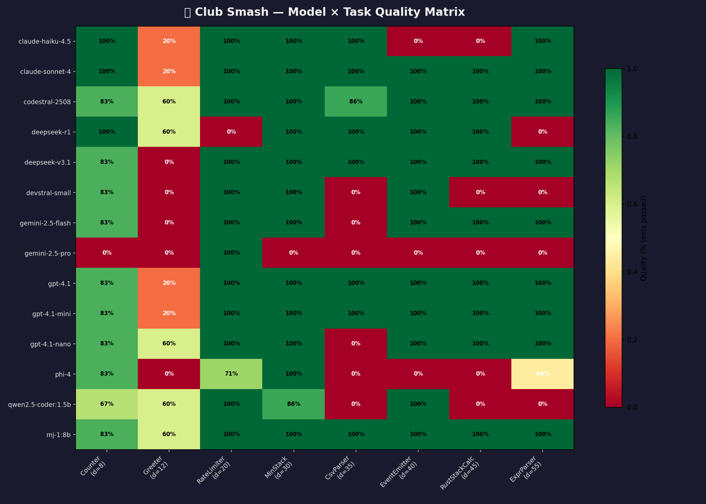
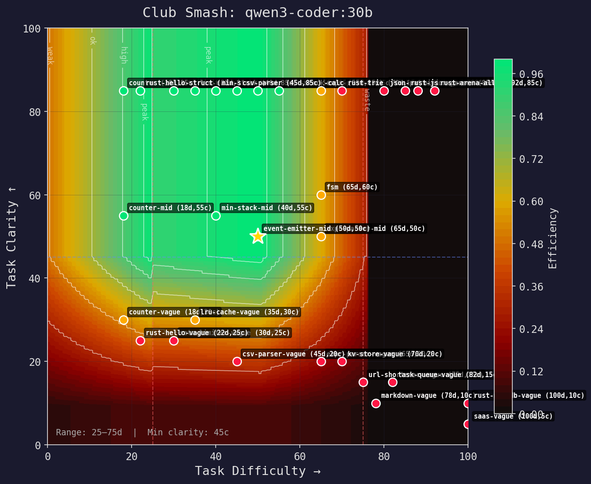

# codeclub

> Caveman not have H100. Caveman only have club.
> But caveman learn which club fit which rock.

## The story

It started with a question: **why does my local 8B model get the same tokens as GPT-5?**

I was running [Caveman](https://github.com/juliusbrussee/caveman) — the insight that
you don't need frontier models if you compress intelligently. Stub out functions,
send structure not source, reconstruct on the other side. Beautiful. 70–95% token
savings. But then I watched my little rnj-1:8b on an Arc B580 nail a rate limiter,
choke on a parser, and completely die on a vague spec.

Same model. Same hardware. Wildly different results. **The model wasn't the problem.
The match was.**

So I built efficiency maps — like turbo compressor maps but for LLMs. Two axes:
task difficulty and spec clarity. Every model has a sweet spot. Outside it, you're
wasting money (too powerful) or wasting time (too weak). Run 232 fights across 19
models and 28 tasks, and the patterns are unmistakable: there's a clarity cliff
below ~40 where *all* models crater, language-specific blindspots (gemini-2.5-pro
literally cannot write valid Rust), and tiny models that outperform giants when
you give them a clear enough spec.

That led to dynamic context — instead of accumulating everything and compacting
when full, index everything and retrieve per-request. Classify the intent, assemble
only what's relevant, optionally uplift vague specs before routing, and pick the
best-fit model for the actual context size. The result: 50–60% token savings *on
top of* compression, and routing that actually knows which club fits which rock.

**Caveman not need biggest club. Caveman need right club.**

---

## What it does

| | What | Result |
|---|---|---|
| 🗜️ **Compress** | Strip context to what the model actually needs | 70–95% fewer tokens, zero quality loss |
| 🔄 **Dev loop** | Spec → generate → test → fix → review → report | Working code from a sentence |
| 🧭 **Route** | Right-size model to task — difficulty, clarity, language | $0 local runs that match cloud quality |
| 🧠 **Dynamic context** | Index everything, retrieve per-request, never fill up | 50–60% fewer tokens on top of compression |

Use one, two, or all four. They compose.

## The numbers

232 fights. 19 models. 47 tasks across Python, Rust, and TypeScript, difficulty 8–95, clarity 5–85.

| Model | Fights | Avg Quality | Avg Time | Total Cost | Hardware |
|---|---:|---:|---:|---:|---|
| **gpt-5.4-mini** | 12 | **94%** | 4.0s | $0.038 | cloud |
| **claude-sonnet-4.6** | 12 | **92%** | 15.4s | $0.270 | cloud |
| **gpt-5.4** | 12 | **91%** | 9.3s | $0.140 | cloud |
| deepseek-v3.1 | 12 | 76% | 54.0s | $0.009 | cloud |
| gemini-2.5-flash | 12 | 73% | 13.7s | $0.085 | cloud |
| **gpt-5.4-nano** | 12 | **72%** | 8.4s | $0.020 | cloud |
| deepseek-r1 | 12 | 71% | 236s | $0.151 | cloud |
| codestral-2508 | 12 | 67% | **3.1s** | $0.007 | cloud |
| **rnj-1:8b** Q6_K | 28 | 45% | 13.8s | $0.0002¹ | Arc B580 (150W) |
| **qwen2.5-coder:1.5b** Q4_K_M | 12 | 43% | 12.9s | $0.0001¹ | CPU (100W) |
| gemma4-26b-a4b Q8_0 | 16 | 33% | 34.4s | $0.0003¹ | GPU (500W) |
| phi-4 | 12 | 26% | 9.9s | $0.001 | cloud |

*¹ Electricity cost at $0.35/kWh. Local models are not free — we track the power.*

### Language capability

Models aren't equally good at everything. Data from high-clarity tasks only:

| Model | Python | Rust | TypeScript | Gap |
|---|---:|---:|---:|---|
| gpt-5.4-mini | 98% | 87% | — | +11pp Py→Rs |
| claude-sonnet-4.6 | 100% | 82% | — | +18pp Py→Rs |
| deepseek-r1 | 63% | **100%** | — | **−33pp** (better at Rust!) |
| devstral-small | 71% | **0%** | — | complete Rust blindspot |
| gemini-2.5-pro | 57% | 38% | — | can't write valid Rust |
| qwen2.5-coder:1.5b | 65% | 12% | — | +53pp Py→Rs |

TypeScript column pending tournament runs — 16 TS/TSX tasks are defined (Counter,
Observable, StateMachine, PromisePool, JSX components, etc.) with a TypeScriptRunner
that handles JSX transpilation via a lightweight VNode shim.

This is why routing needs a language axis. Sending a Rust task to gemini-2.5-pro is
burning money. → [Full results](docs/benchmarks.md)

### Dogfood: building codeclub with codeclub

Five features built this session. All routed to Opus ($15/Mtok). What codeclub
would have done:

| | Actual | Routed | Saved |
|---|---:|---:|---:|
| Tokens | 244,500 | 38,600 | 84% |
| Cost | $5.26 | $0.74 | **86%** |

3 of 5 tasks didn't need frontier — Sonnet or GPT-5.1 would have worked.
Context compression cut tokens 84%. Two effects compound: **cheaper model ×
fewer tokens = 86% savings.** → [Full breakdown](docs/club-smash.md#dogfood-building-codeclub-with-codeclub)

### Compression savings (real files)

| File | Tokens | After pipeline | Saved |
|---|---:|---:|---:|
| wallet_stripe.py (934 lines) | 7,202 | 300 | **96%** |
| 2 wallet files combined (1,343 lines) | 9,680 | 789 | **92%** |
| wallet_local.py (409 lines) | 2,478 | 489 | **80%** |
| wallet_bridge_snippet.py (78 lines) | 504 | 160 | **68%** |

## Quick start

```bash
git clone https://github.com/ozmalabs/codeclub && cd codeclub
uv sync
uv run pytest tests/

# Hit task with club
uv run python dev_loop.py "Build a rate limiter with token bucket algorithm" \
    --setup local_gpu \
    --max-iterations 3 \
    --output rate_limiter.py
```

---

## Compress — send less, pay less

LLM agents send whole files as context. Most is irrelevant. You pay for every token
the model ignores.

```python
from codeclub.compress import stub_functions

compressed, source_map = stub_functions(code, language="python")
# 500 lines → 40 lines, round-trippable
```

9,680 tokens → 444 tokens with semantic retrieval. Model sees only what matters.
Round-trip expansion splices edits back into the original. No diff required.

→ [How compression works](docs/compression.md)

## Dev loop — agents? me only know caveman

No agent framework. No orchestration layer. A loop, a test runner, and whatever
models you have.

```python
from codeclub.dev import run
from codeclub.infra.models import router_for_setup

# Use whatever you have — local GPU, cloud API, or both
result = run("Build a RateLimiter class with token bucket algorithm",
             router=router_for_setup("local_gpu"))
```

Big model designs the skeleton. Small model fills each function in parallel
([Skeleton-of-Thought](https://arxiv.org/abs/2307.15337)). Once the stub map sets
the interface contract, filling a single isolated function body is well within a 3B
model's capability. You don't need a frontier model for the whole thing.

Stack hints auto-detect your project type and inject library constraints into every
prompt. Data-driven, not LLM-based. Models use the right libraries, right versions,
right patterns — no hallucinated imports, no outdated APIs.

```bash
# Auto-detects "cli" stack from task keywords
uv run python dev_loop.py "Build a CLI tool that manages nvmeof devices" \
    --setup local_gpu

# Or specify explicitly
uv run python dev_loop.py "Build a REST API for user management" \
    --setup copilot --stack web-api
```

5 stacks: `web-api` · `cli` · `data` · `library` · `async-service`

Tests fail → compress failure → re-fill → repeat. Converges in 1–2 iterations.
Reviewer is a different model from the generator — same model normalises over its
own bugs.

Every run produces a ledger: wallclock, tokens, energy, cost, and what the same
task would have cost on GPT-4o. Pass `--electricity-rate 0.28` if you're in the UK.

→ [How the dev loop works](docs/dev-loop.md)

## Route — club until it fits

> You tell codeclub what you have. It hits the task with a club until it fits.

Define your hardware once. The router picks models that fit. Got a GPU? It tries
the best quality quant first. Doesn't fit in VRAM? Steps down through
Q6_K → Q4_K_M → Q3_K_M. Nothing fits on GPU? Falls back to CPU. No internet?
No problem.

**Plan before you run.** The cost estimator predicts price, time, and quality
for every model on your task — before spending a single token.

```python
from tournament import recommend_routing, SmashCoord, build_contenders

rec = recommend_routing(SmashCoord(45, 70), build_contenders(), lang="python")
rec.best_value     # cheapest correct answer
rec.best_speed     # fastest correct answer
rec.best_compound  # best blend
```

Compare strategies across a whole project: compound routing picks cheap models
for easy tasks and stronger models for hard ones — $0.004 at 93% quality vs
$0.031 at 89% using a fixed cloud model.

Example setups (or define your own):

| Setup | What |
|---|---|
| `local_only` | Ollama CPU, no internet |
| `local_gpu` | GPU for map/review, CPU for fill (any GPU — B580, 3060, 4090, etc.) |
| `copilot` | GitHub Copilot SDK (free) |
| `anthropic` | Direct Anthropic API |
| `openrouter_cheap` | Paid OpenRouter < $0.002/call |
| `best_local_first` | Local preferred, cloud fallback |

Six providers. Zero config for local, one env var for cloud. Hardware-aware —
the router knows your VRAM, your model sizes, your quant levels.

→ [How routing works](docs/routing.md)

## Club Smash — right-sizing models to tasks

> You don't use a sledgehammer to crack a nut. Club Smash find right club.

Every model has an efficiency map — like a turbo compressor map. Two axes:
**difficulty** (how hard) and **clarity** (how well-specified). The sweet spot
is where the model is right-sized. Outside it, the model is either overkill or
overwhelmed.

**Compound efficiency** goes further — separating **value** (quality per dollar)
from **speed** (wallclock time). A `speed_weight` parameter lets you dial between
pure value (batch jobs) and speed-critical (interactive coding). Hardware
profiles (9 tiers from budget CPU to H100) adjust wallclock estimates without
changing value scores.

The empirical finding: there's a **clarity cliff** around 40. Below it, *every*
model craters to ~0% regardless of capability. Above 50, even small models hit
80–100%. This isn't a linear decay — it's a sigmoid. The routing system uses this
to decide when a vague spec should be uplifted before sending to any model.

**Request classification.** Before routing, the system detects *what kind* of
task this is — coding (build/bugfix), sysadmin (docker/networking/database),
cloud/IaC (Terraform/AWS/CI-CD), debug, or cross-codebase. This matters because
a d=45 coding task costs ~1.2K tokens, but a d=45 sysadmin task costs ~22K —
context gathering dominates. The classifier runs in microseconds (keyword
heuristics, no LLM call) and selects the right `TaskProfile` for cost estimation.

**Task profiles & context strategies.** Real-world sysadmin and cloud tasks
aren't just "generate code" — they involve rounds of context gathering (reading
logs, checking configs), iteration loops (apply → observe → adjust), and dead
wallclock time (builds, deploys, health checks). 33 task profiles model this
cost structure. 5 context strategy presets show how compression + retrieval
attack the gathering cost:

| Strategy | Tokens | Cost | Wallclock | Technique |
|---|---:|---:|---:|---|
| Naive | 1,005K | $0.178 | 271 min | no context management |
| Compress | 397K | $0.070 | 254 min | structural compression |
| Retrieve | 470K | $0.082 | 225 min | semantic retrieval |
| **Full pipeline** | **116K** | **$0.020** | **164 min** | compress + retrieve + index + cache |
| | **−88%** | **−89%** | **−39%** | |

The 39% wallclock floor is physics — Docker builds, Terraform applies, and health
checks can't be compressed. But the token cost drops 88%.

**Parallelism.** Some tasks decompose into a skeleton (map) + independent
function bodies (fills) that run concurrently on cheap models. The system
estimates decomposability from task structure and compares oneshot vs decomposed
cost/time. Decomposition wins for many-method tasks (CRUD, REST) where fills
can use 1.5B models; oneshot wins for tightly-coupled code where cheap models
already handle it.

Roles aren't special code paths — they're just coordinates on this plane:

| Role | Difficulty offset | Clarity | What it means |
|---|---|---|---|
| `fill` | −10 | 90 | Skeleton → code. Very clear, easier. |
| `map` | 0 | 70 | NL → architecture. Baseline difficulty. |
| `oneshot` | +10 | 65 | NL → complete code. Harder, less clear. |
| `review` | −5 | 75 | Check existing code. Moderate. |

### Efficiency maps

**Quality matrix** — 19 models × 47 tasks (Python, Rust, TypeScript). Green=100%, red=0%.



**rnj-1:8b** (8B, Q6_K, B580 GPU) — Tight island around 35d. Nails easy-moderate
tasks with clear specs. The caveman's club.


**qwen3-coder:30b** (30B, Q4_K_M, CPU) — Wide plateau. Handles ambiguity, covers
most of the task space.



**Model overlay** — all models on one chart. Find the gaps, find the overlaps.


**Quantization comparison** — same model, different quants. See how much
capability you lose stepping down from bf16 → Q4_K_M → Q2_K.


```bash
python smash_viz.py                           # generate all maps
python smash_viz.py --quant-compare rnj-1:8b  # compare quants
python smash_server.py                        # interactive browser
python tournament.py --map                    # ASCII in terminal
```

→ [How Club Smash works](docs/club-smash.md)

## Dynamic context — index everything, send nothing

> The major problem with LLM conversations is context waste. Long, vague
> discussions fill the window, then get compacted. Horribly inefficient.

Instead: **index everything, retrieve per-request, never fill up.**

The proxy sits between your client and any OpenAI-compatible API. For each
request it:

1. **Classifies** intent (10 categories — new task, debug, follow-up, refactor...)
2. **Estimates clarity** and decides if the spec needs uplifting first
3. **Assembles** only relevant context — code refs, recent turns, decisions
4. **Routes** to the best-fit model given the actual context size
5. **Indexes** the response for future retrieval
6. **Compacts** old episodes in the background

Five fit precision levels let you trade context tightness for safety margin:
`minimal` → `tight` → `balanced` → `generous` → `full`

The system learns: an adaptive tracker records outcomes per intent/fit level and
adjusts padding automatically. If the model keeps asking for more context, the
budget grows. If everything succeeds, it tightens.

```bash
# Start the proxy
python -m codeclub.context --upstream http://localhost:11434/v1

# Use any OpenAI-compatible client — it's transparent
curl http://localhost:8400/v1/chat/completions \
    -H "Content-Type: application/json" \
    -H "X-Context-Fit: tight" \
    -d '{"model": "rnj-1:8b", "messages": [{"role": "user", "content": "fix the auth bug"}]}'
```

→ [How dynamic context works](docs/dynamic-context.md)

## Agent plugin

Teach your AI agent how to use codeclub. One command. Works everywhere.

| Agent | Install |
|-------|---------|
| **Claude Code** | `claude mcp add codeclub -- uv run python -m codeclub.claude_code_mcp` |
| **Copilot CLI** | `/mcp add codeclub -- python -m codeclub.mcp_server` |
| **Codex** | Clone repo → `/plugins` → Install |
| **Gemini CLI** | `gemini extensions install https://github.com/ozmalabs/codeclub` |
| **Cursor** | `npx skills add ozmalabs/codeclub -a cursor` |
| **Windsurf** | `npx skills add ozmalabs/codeclub -a windsurf` |
| **Copilot (VS Code)** | `npx skills add ozmalabs/codeclub -a github-copilot` |
| **Cline** | `npx skills add ozmalabs/codeclub -a cline` |
| **Any MCP client** | Add `.mcp.json` from this repo, or run `python -m codeclub.mcp_server` |
| **Any other** | `npx skills add ozmalabs/codeclub` |

### Claude Code

The Claude Code MCP server routes tasks across haiku / sonnet / opus and
exposes the full dev loop. Five tools:

| Tool | What it does |
|------|-------------|
| `pick_model` | Classify task → pick cheapest capable model + context strategy |
| `classify_task` | Raw classification: difficulty, clarity, category, coordinates |
| `compress_context` | Stub function bodies (70–95% reduction), no CJK artifacts |
| `estimate_cost` | Side-by-side cost comparison across all three models |
| `run_dev_loop` | Full pipeline: spec → generate → test → fix → review → report |

```bash
# Install — from the codeclub repo directory
claude mcp add codeclub -- uv run python -m codeclub.claude_code_mcp
```

**Routing is haiku-generous.** Most single-file coding, tests, debugging, and
standard feature work routes to haiku (1x cost). Sonnet (4x) handles
multi-file coordination and complex debugging. Opus (19x) is reserved for
security, distributed systems, and architecture decisions. Low clarity
escalates one tier — vague specs need more reasoning.

| Difficulty | Clarity >= 35 | Clarity < 35 |
|---|---|---|
| d <= 35 | haiku | sonnet |
| 36-65 | sonnet | opus |
| d > 65 | opus | opus |

**Dev loop** runs the full codeclub pipeline inside Claude Code. Pass a
natural language task and get back working, tested, reviewed code:

```
run_dev_loop(task="Build a RateLimiter with token bucket algorithm",
             setup="anthropic", stack="library")
→ { "passed": true, "approved": true, "code": "...", "report": "..." }
```

The loop uses the Anthropic API by default. Set `setup="copilot"` for
GitHub Copilot models, `setup="best_local_first"` for local GPU + cloud
fallback. Each run returns a cost ledger.

**Context strategy** is one binary switch: if your context is over ~40k
tokens, the tool recommends compressing before sending to the sub-agent.
Call `compress_context` to stub function bodies down to signatures + `...`.

### MCP server — generic (Copilot CLI, Claude Desktop, any MCP client)

The generic MCP server exposes seven tools over stdio:

| Tool | What it does |
|------|-------------|
| `set_available_models` | Seed with YOUR client's models so routing is executable |
| `classify_task` | Classify any task → category, confidence, suggested profile |
| `estimate_cost` | Full routing plan → tokens, cost, wallclock, reasoning |
| `compress_context` | Compress code/text → token savings |
| `route_model` | Difficulty + clarity → per-phase model picks + context strategy |
| `list_models` | Show available models with Copilot multipliers and costs |
| `list_profiles` | Browse 31 task profiles with cost estimates |

```bash
# Copilot CLI — one command
/mcp add codeclub -- python -m codeclub.mcp_server

# Or with PYTHONPATH if not in the repo directory
/mcp add codeclub --env PYTHONPATH=/path/to/codeclub -- python /path/to/codeclub/codeclub/mcp_server.py

# Workspace config — drop .mcp.json in your repo root (already included)
```

No API keys needed for routing/classification — pure heuristics, zero LLM calls.

Copilot users: seed your models first — routing then knows GPT-4.1 is free (0x)
and only escalates to Sonnet (1x) or Opus (10x) when complexity demands it.
Route includes context strategy: **maximise context for Copilot** (per-prompt billing),
compress for API (per-token billing). See [Copilot billing](docs/copilot-billing.md).

## Install

```bash
pip install codeclub          # everything
pip install codeclub-compress # compression only
pip install codeclub-dev      # dev loop only
pip install codeclub-infra    # routing only
```

## Docs

- [Compression](docs/compression.md) — tree-sitter stubbing, semantic retrieval, brevity constraints
- [Dev loop](docs/dev-loop.md) — pipeline, fix loop, benchmarks, accounting
- [Routing](docs/routing.md) — hardware declaration, setup presets, providers, request classification
- [Club Smash](docs/club-smash.md) — efficiency maps, task profiles, context strategies, right-sizing
- [Copilot billing](docs/copilot-billing.md) — premium request multipliers, context maximisation, cost strategy
- [Dynamic context](docs/dynamic-context.md) — session indexing, per-request retrieval, adaptive fit
- [Benchmarks](docs/benchmarks.md) — full results, reproduction steps, methodology
- [Architecture](docs/architecture.md) — file map, references

## References

- [Caveman](https://github.com/juliusbrussee/caveman) — the original insight: you don't need frontier models
- [arXiv:2307.15337](https://arxiv.org/abs/2307.15337) — Skeleton-of-Thought: Prompting LLMs for Efficient Parallel Generation
- [arXiv:2604.00025](https://arxiv.org/abs/2604.00025) — Inverse Scaling Can Be Easily Overcome With Scale-Aware Prompting
- [arXiv:2601.19929](https://arxiv.org/abs/2601.19929) — Stingy Context / TREEFRAG structural compression
- [Compressor maps](https://en.wikipedia.org/wiki/Compressor_map) — the analogy behind efficiency maps

## Star This Repo

If caveclub save you mass token, mass money — leave mass star. ⭐

[](https://star-history.com/#ozmalabs/codeclub&Date)

---

Brought to you by Ozma from [ozmalabs.com](https://ozmalabs.com).
