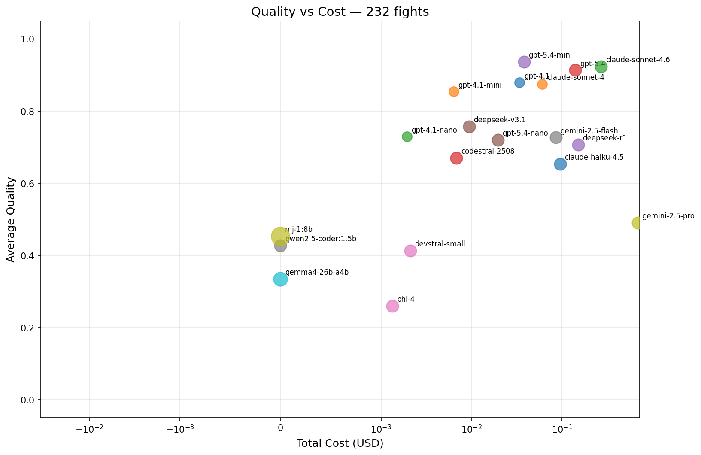
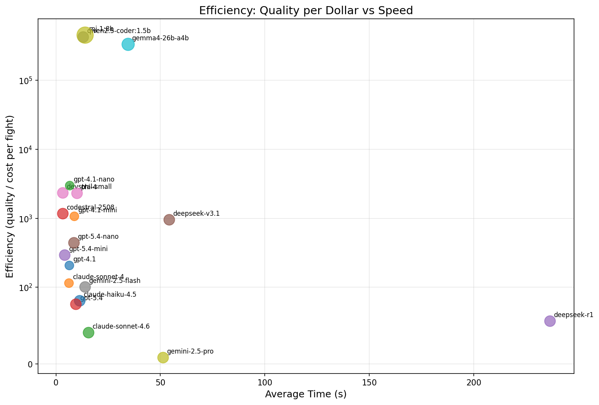

# codeclub

> Caveman not have H100. Caveman only have club.

Three tools that compose. Use one, two, or all three.

| | What | Result |
|---|---|---|
| 🗜️ **Compress** | Strip context to what the model actually needs | 70–95% fewer tokens, zero quality loss |
| 🔄 **Dev loop** | Spec → generate → test → fix → review → report | Working code from a sentence |
| 🧭 **Route** | Club until it fits | $0 local runs that match cloud quality |

## Caveman vs cloud

118 fights. 14 models. 8 tasks (Python + Rust, difficulty 8–55). Real runs, real numbers.

| Model | Pass Rate | Avg Time | Total Cost | Cost/Pass |
|---|---|---|---|---|
| **rnj-1:8b** Q6_K (local 8B) | **75%** | 11.7s | **$0.00** | **FREE** |
| **claude-sonnet-4.6** | **80%** | 6.5s | $0.07 | $0.008 |
| **gpt-5.4** | **75%** | 6.3s | $0.03 | $0.006 |
| **deepseek-v3.1** bf16 | **75%** | 29.3s | $0.004 | $0.0007 |
| **codestral-2508** bf16 | 62% | **3.0s** | $0.003 | $0.0007 |
| gpt-5.4-nano | 50% | 5.7s | $0.002 | $0.0004 |
| devstral-small | 38% | **2.7s** | $0.001 | $0.0004 |
| gemini-2.5-pro | 12% | 34.1s | **$0.25** | **$0.25** |

Caveman pay electricity. Cloud pay rent. Electricity cheaper.




### Compression savings (real files)

| File | Tokens | After full pipeline | Saved |
|---|---:|---:|---:|
| wallet_stripe.py (934 lines) | 7,202 | 300 | **96%** |
| 2 wallet files combined (1,343 lines) | 9,680 | 789 | **92%** |
| wallet_local.py (409 lines) | 2,478 | 489 | **80%** |
| wallet_bridge_snippet.py (78 lines) | 504 | 160 | **68%** |

→ [Full benchmark results](benchmarks/results/latest.md)

## Quick start

```bash
git clone https://github.com/ozmalabs/codeclub && cd codeclub
uv sync
uv run pytest tests/

# Hit task with club (use any setup — local_gpu, copilot, anthropic, etc.)
uv run python dev_loop.py "Build a rate limiter with token bucket algorithm" \
    --setup local_gpu \
    --max-iterations 3 \
    --output rate_limiter.py
```

---

## Compress — send less, pay less

LLM agents send whole files as context. Most is irrelevant. You pay for every token
the model ignores.

```python
from codeclub.compress import stub_functions

compressed, source_map = stub_functions(code, language="python")
# 500 lines → 40 lines, round-trippable
```

9,680 tokens → 444 tokens with semantic retrieval. Model sees only what matters.
Round-trip expansion splices edits back into the original. No diff required.

→ [How compression works](docs/compression.md)

## Dev loop — agents? me only know caveman

No agent framework. No orchestration layer. A loop, a test runner, and whatever
models you have.

```python
from codeclub.dev import run
from codeclub.infra.models import router_for_setup

# Use whatever you have — local GPU, cloud API, or both
result = run("Build a RateLimiter class with token bucket algorithm",
             router=router_for_setup("local_gpu"))
```

Big model designs the skeleton. Small model fills each function in parallel
(Skeleton-of-Thought). Once the stub map sets the interface contract, filling a
single isolated function body is well within a 3B model's capability. You don't
need a frontier model for the whole thing.

Stack hints auto-detect your project type and inject library constraints into every
prompt. Data-driven, not LLM-based. Models use the right libraries, right versions,
right patterns — no hallucinated imports, no outdated APIs.

```bash
# Auto-detects "cli" stack from task keywords
uv run python dev_loop.py "Build a CLI tool that manages nvmeof devices" \
    --setup local_gpu

# Or specify explicitly
uv run python dev_loop.py "Build a REST API for user management" \
    --setup copilot --stack web-api
```

5 stacks: `web-api` · `cli` · `data` · `library` · `async-service`

Tests fail → compress failure → re-fill → repeat. Converges in 1–2 iterations.
Reviewer is a different model from the generator — same model normalises over its
own bugs.

Every run produces a ledger: wallclock, tokens, energy, cost, and what the same
task would have cost on GPT-4o. Pass `--electricity-rate 0.28` if you're in the UK.

→ [How the dev loop works](docs/dev-loop.md)

## Route — club until it fits

> You tell codeclub what you have. It hits the task with a club until it fits.

Define your hardware once. The router picks models that fit. Got a GPU? It tries
the best quality quant first. Doesn't fit in VRAM? Steps down through
Q6_K → Q4_K_M → Q3_K_M. Nothing fits on GPU? Falls back to CPU. No internet?
No problem.

Example setups (or define your own):

| Setup | What |
|---|---|
| `local_only` | Ollama CPU, no internet |
| `local_gpu` | GPU for map/review, CPU for fill (any GPU — B580, 3060, 4090, etc.) |
| `copilot` | GitHub Copilot SDK (free) |
| `anthropic` | Direct Anthropic API |
| `openrouter_cheap` | Paid OpenRouter < $0.002/call |
| `best_local_first` | Local preferred, cloud fallback |

Six providers. Zero config for local, one env var for cloud. Hardware-aware —
the router knows your VRAM, your model sizes, your quant levels.

→ [How routing works](docs/routing.md)

## Club Smash — right-sizing models to tasks

> You don't use a sledgehammer to crack a nut. Club Smash find right club.

Every model has an efficiency map — like a turbo compressor map. Two axes:
**difficulty** (how hard) and **clarity** (how well-specified). The sweet spot
is where the model is right-sized. Outside it, the model is either overkill or
overwhelmed.

Roles aren't special code paths — they're just coordinates on this plane:

| Role | Difficulty offset | Clarity | What it means |
|---|---|---|---|
| `fill` | −10 | 90 | Skeleton → code. Very clear, easier. |
| `map` | 0 | 70 | NL → architecture. Baseline difficulty. |
| `oneshot` | +10 | 65 | NL → complete code. Harder, less clear. |
| `review` | −5 | 75 | Check existing code. Moderate. |

### Efficiency maps

**Quality matrix** — 14 models × 8 tasks. Green=100%, red=0%. The full picture.


**rnj-1:8b** (8B, Q6_K, B580 GPU) — Tight island around 35d. Nails easy-moderate tasks with clear specs.


**qwen3-coder:30b** (30B, Q4_K_M, CPU) — Wide plateau. Handles ambiguity, covers most of the task space.


**Model overlay** — all models on one chart. Find the gaps, find the overlaps.


**Quantization comparison** — same model, different quants. See how much
capability you lose stepping down from bf16 → Q4_K_M → Q2_K.


```bash
python smash_viz.py                           # generate all maps
python smash_viz.py --quant-compare rnj-1:8b  # compare quants
python smash_server.py                        # interactive browser
python tournament.py --map                    # ASCII in terminal
```

→ [How Club Smash works](docs/club-smash.md)

## Agent plugin

Teach your AI agent how to use codeclub. One command. Works everywhere.

| Agent | Install |
|-------|---------|
| **Claude Code** | `claude plugin install codeclub@codeclub` |
| **Codex** | Clone repo → `/plugins` → Install |
| **Gemini CLI** | `gemini extensions install https://github.com/ozmalabs/codeclub` |
| **Cursor** | `npx skills add ozmalabs/codeclub -a cursor` |
| **Windsurf** | `npx skills add ozmalabs/codeclub -a windsurf` |
| **Copilot** | `npx skills add ozmalabs/codeclub -a github-copilot` |
| **Cline** | `npx skills add ozmalabs/codeclub -a cline` |
| **Any other** | `npx skills add ozmalabs/codeclub` |

Install once. Agent knows compress, dev loop, and routing APIs from first message.

## Install

```bash
pip install codeclub          # everything
pip install codeclub-compress # compression only
pip install codeclub-dev      # dev loop only
pip install codeclub-infra    # routing only
```

## Docs

- [Compression](docs/compression.md) — tree-sitter stubbing, semantic retrieval, brevity constraints
- [Dev loop](docs/dev-loop.md) — pipeline, fix loop, benchmarks, accounting
- [Routing](docs/routing.md) — hardware declaration, setup presets, providers, dynamic levers
- [Club Smash](docs/club-smash.md) — two-axis model routing, efficiency maps, right-sizing
- [Benchmarks](docs/benchmarks.md) — full results, reproduction steps, methodology
- [Architecture](docs/architecture.md) — file map, references

## References

- arXiv:2307.15337 — Skeleton-of-Thought: Prompting LLMs for Efficient Parallel Generation
- arXiv:2604.00025 — Inverse Scaling Can Be Easily Overcome With Scale-Aware Prompting
- arXiv:2601.19929 — Stingy Context / TREEFRAG structural compression
- [Caveman](https://github.com/juliusbrussee/caveman)

## Star This Repo

If caveclub save you mass token, mass money — leave mass star. ⭐

[](https://star-history.com/#ozmalabs/codeclub&Date)

---

Brought to you by Ozma from [ozmalabs.com](https://ozmalabs.com).
