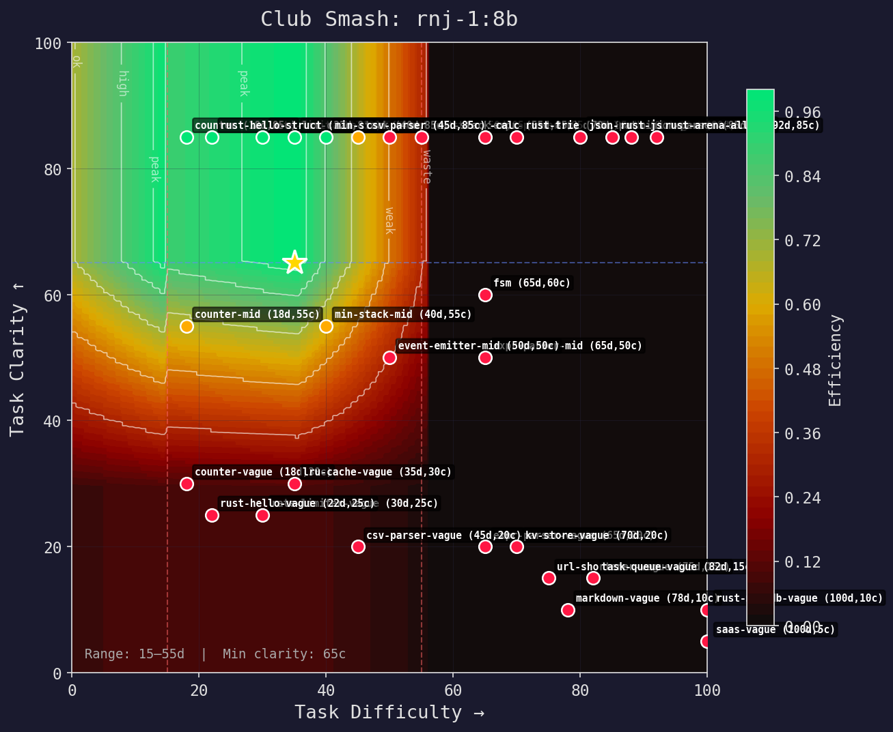
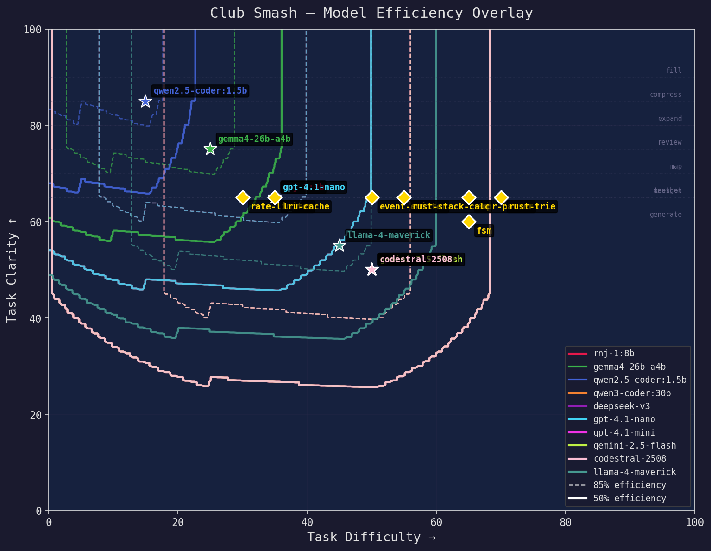
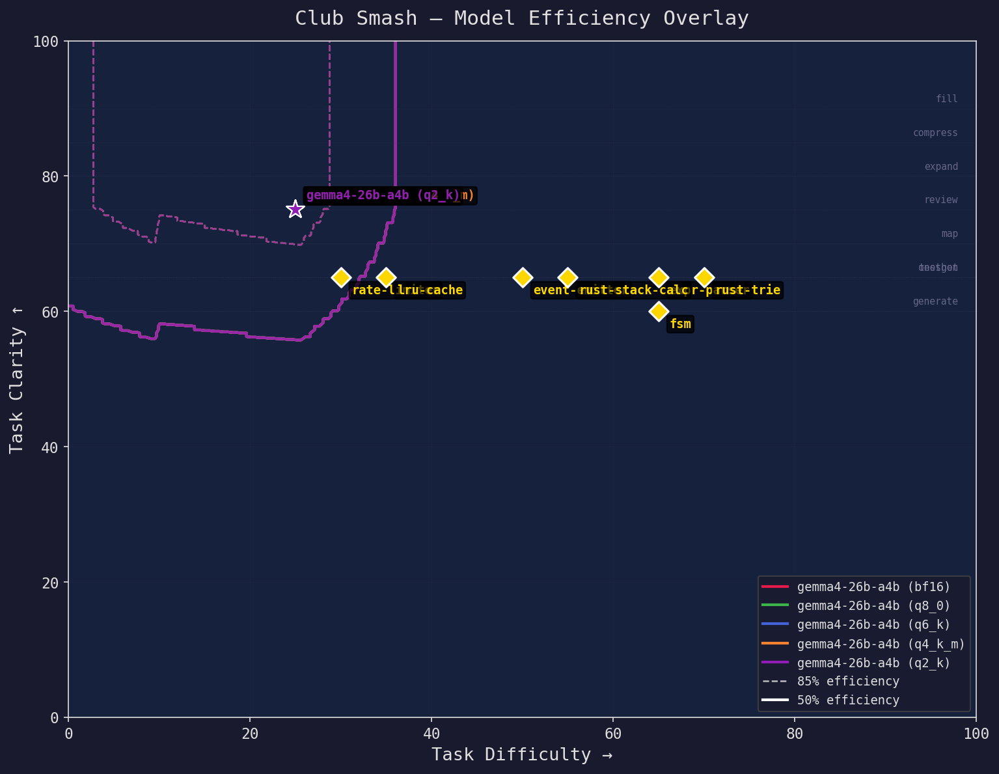

# Club Smash — Right-Sizing Models to Tasks

> You don't use a sledgehammer to crack a nut.
> You don't use a nut to crack a boulder.
> Club Smash finds the right club.

Club Smash is a two-axis efficiency system that maps every model and every task
onto the same plane, then routes by geometry — no role-specific logic, no
if/else chains.

## The two axes

**Difficulty** (0–100): How hard is the problem?

```
0 ────────────────────────────────────────── 100
trivial        moderate       hard        PhD-level
"rename var"   "rate limiter" "parser"    "compiler"
```

**Clarity** (0–100): How well-specified is the input?

```
0 ────────────────────────────────────────── 100
vague chat     spec doc       skeleton    skeleton + tests
"make it work" "build X with" "fill this" "fill this, here are tests"
```

## The compressor map

Every model has an efficiency region on this plane — exactly like a turbo
compressor map. There's a sweet spot where the model is right-sized, a
boundary where it starts struggling, and an outer region where it's either
overkill or overwhelmed.

```
    100c │▒▒▒▒▓▓▓█▓▓▓▓▓▓█████▓▒▒░░░···          │
     85c │▒▒▒▒▓▓▓█▓▓▓▓▓▓█████▓▒▒░░░···          │  ← min clarity
     70c │▒▒▒▒▓▓▓█▓▓▓▓▓▓█████▓▒▒░░░···          │
     55c │░░░░░░▒▒░░░░▒▒▒▒▒▒▒░░░░····           │
     40c │   ··················                   │
         └────────────────────────────────────────┘
          0    10   20   30   40   50   60   70
                      difficulty →

    █ peak  ▓ high  ▒ ok  ░ weak  · waste
```

Small models have a tight, high-up island — they need clear instructions but
nail simple tasks fast. Large models have a wide, low plateau — they handle
ambiguity but are wasteful on simple work.

### How to read it

- **Green/peak zone**: model is right-sized. Fast, cheap, accurate.
- **Orange/weak zone**: model can do it but it's struggling or overkill.
- **Red/waste zone**: wrong tool for the job.
- **★ star**: the model's sweet spot.
- **◆ diamonds**: where benchmark tasks land on this model's map.

## Roles are coordinates

The key insight: roles like `fill`, `map`, `review`, `oneshot` aren't special
code paths — they're just reference points on the plane.

```python
ROLE_DEFAULTS = {
    "fill":      {"diff_offset": -10, "clarity": 90},  # skeleton → code
    "expand":    {"diff_offset":  -5, "clarity": 80},
    "compress":  {"diff_offset": -15, "clarity": 85},
    "review":    {"diff_offset":  -5, "clarity": 75},
    "map":       {"diff_offset":   0, "clarity": 70},  # NL → architecture
    "testgen":   {"diff_offset":  +5, "clarity": 65},
    "generate":  {"diff_offset":  +5, "clarity": 60},
    "oneshot":   {"diff_offset": +10, "clarity": 65},  # NL → complete code
}
```

A `fill` task at base difficulty 50 becomes `(40d, 90c)` — easier (skeleton
helps) and very clear (you can see what to write). An `oneshot` at the same
base is `(60d, 65c)` — harder and less clear.

This means:
- **No role-specific routing code.** The router just checks `model.smash.covers(task_coord)`.
- **New roles are free.** Add a row to the table, routing works automatically.
- **Tasks can override.** If a specific task's `fill` is unusually hard, it
  provides a custom coordinate.

## SmashRange — the model envelope

Every model gets a `SmashRange` describing its operating envelope:

```python
SmashRange(
    low=15,         # minimum difficulty it handles
    sweet=35,       # peak efficiency point
    high=55,        # maximum difficulty it can attempt
    min_clarity=65, # below this, model can't handle the ambiguity
)
```

Estimated from model specs:

| Effective params | Range | Min clarity |
|---|---|---|
| <2B | 5–15–25 | 85+ |
| <5B | 10–25–40 | 75+ |
| <10B | 15–35–55 | 65+ |
| <20B | 20–45–65 | 55+ |
| <40B | 25–50–75 | 45+ |
| <80B | 30–55–85 | 35+ |
| 80B+ | 35–60–95 | 25+ |

Quantization degrades capability: Q8→0.95×, Q6_K→0.90×, Q4_K_M→0.80×, Q2_K→0.55×.

These estimates are the cold start — used before real benchmarks exist. Once a model
has an empirical efficiency map, the map is the truth regardless of architecture.

## Efficiency visualisation

Generate turbo compressor–style efficiency maps:

```bash
# All models + overlay + comparisons → benchmarks/maps/
python smash_viz.py

# Single model
python smash_viz.py --model rnj-1:8b

# Compare quantizations
python smash_viz.py --quant-compare gemma4-26b-a4b

# Interactive HTML viewer
python smash_server.py
```

Three output formats:
- **PNG** (matplotlib) — publication-quality static images
- **HTML** (plotly) — interactive hover, zoom, toggle models on/off
- **ASCII** (terminal) — `python tournament.py --map`

### Example: rnj-1:8b (8B, Q6_K, Intel Arc B580)



Tight island around 35d difficulty, needs 65+ clarity. Tasks like RateLimiter
(30d) and LRU Cache (35d) land right in the sweet spot. ExprParser (65d) is at
the edge — it works because the task has very high clarity (well-specified tests).

### Example: Model overlay



All models on one chart. You can see:
- **qwen2.5-coder:1.5b** — tiny island, high clarity only
- **rnj-1:8b / gpt-4.1-nano** — mid-range, overlapping
- **qwen3-coder:30b / deepseek-v3** — wide coverage, low clarity tolerance
- Tasks cluster in the 30–70 difficulty, 60–90 clarity range

### Example: Quantization comparison



Same model (gemma4-26b-a4b), different quantizations. bf16 has the widest
envelope; Q2_K shrinks it dramatically. This helps decide: is Q4_K_M good
enough for your tasks, or do you need Q6_K?

## The fit function

`SmashRange.fit(coord)` returns 0.0–1.0:

```
1.0  ─── peak efficiency (sweet spot)
0.85 ─── high efficiency
0.70 ─── usable
0.50 ─── marginal (covers threshold)
0.30 ─── struggling
0.0  ─── out of range
```

Two gates multiplied:
- **Difficulty gate**: undersized (above high) → 0, oversized (below low) →
  slight penalty, sweet spot → ~1.0
- **Clarity gate**: above min_clarity → 1.0, below → steep penalty

## Language proficiency

Models aren't equally good at every language. `fit()` accepts `lang` and
`lang_proficiency` to scale the quality gate:

```python
fit_score = smash.fit(coord, lang="rust", lang_proficiency={"python": 0.98, "rust": 0.87})
```

15 of 18 benchmarked models have measured proficiency from tournament fights.
The remaining 3 use a heuristic estimate based on model family and size. Data
lives in `MEASURED_LANG_PROFICIENCY` — the routing system looks it up
automatically via `Contender.__post_init__()`.

| Model | Python | Rust | TypeScript | Gap |
|---|---:|---:|---:|---|
| gpt-5.4-mini | 98% | 87% | — | +11pp Py→Rs |
| claude-sonnet-4.6 | 100% | 82% | — | +18pp Py→Rs |
| deepseek-r1 | 63% | **100%** | — | −33pp (better at Rust!) |
| devstral-small | 71% | **0%** | — | complete Rust blindspot |

TypeScript proficiency data pending tournament runs on 16 TS/TSX tasks (Counter,
Observable, StateMachine, PromisePool, JSX components like Greeting and
ToggleButton). TypeScriptRunner handles JSX transpilation via lightweight VNode
shim — no React import needed.

This is why routing needs a language axis. Sending a Rust task to a model with
a 0% Rust score wastes money regardless of difficulty/clarity.

## Compound efficiency

The fit function tells you **can this model do it?** — but not **should** it.
Two models might both score 0.85 fit, but one costs $0.001 and the other
$0.10. Compound efficiency separates value from speed.

### Two separable axes

**Value efficiency** (0–100): quality per dollar, speed-independent.

```python
value_efficiency(quality=0.85, cost_input=0.15, cost_output=0.60,
                 coord=SmashCoord(35, 70))
# → 91.3  (high quality, very cheap)
```

A slow model that's cheap and accurate scores high. A fast expensive model
scores lower. This is the "batch job" metric — you don't care how long it
takes, only what it costs per correct answer.

**Wallclock score** (0–100): how fast, cost-independent.

```python
wallclock_score(tok_s=45.0, coord=SmashCoord(35, 70),
               hw_speed_modifier=2.2)  # RTX 4090
# → 82.1  (fast on good hardware)
```

Affected by hardware AND cloud provider load. Same model on a budget CPU
(0.15×) vs an H100 (5.0×) gives wildly different wallclock scores.

**Compound efficiency** blends them via geometric weighting:

```
compound = value × (speed / 100) ^ speed_weight
```

- `speed_weight=0.0` → pure value (overnight batch)
- `speed_weight=0.5` → balanced (default)
- `speed_weight=1.0` → speed-critical (interactive coding)

### Curve parameters

| Parameter | Value | Meaning |
|---|---|---|
| `SPEED_TAU` | 30s | 30s completion ≈ 37% speed score |
| `COST_TAU` | $0.01 | $0.01/task ≈ 50% cost score |

These control where the sigmoid/exponential curves sit. Sub-penny tasks
and sub-10-second completions score well; $0.10+ tasks and 60s+ completions
score poorly.

## Hardware profiles

Hardware affects wallclock time, not value. A model's quality per dollar
doesn't change on faster hardware — but your wait does.

| Profile | Speed | Power | Description |
|---|---:|---:|---|
| `cpu_budget` | 0.15× | 65W | i5 / Ryzen 5, 32GB |
| `cpu_workstation` | 0.35× | 100W | Xeon / Threadripper, 128GB |
| `gpu_consumer` | **1.0×** | 150W | RTX 3060 / Arc B580 — **reference** |
| `gpu_midrange` | 1.5× | 200W | RTX 4070 / Arc B770, 16GB |
| `gpu_enthusiast` | 2.2× | 350W | RTX 4090 / RTX 5080, 24GB |
| `gpu_workstation` | 3.0× | 300W | A6000 / L40S, 48GB |
| `a100` | 3.5× | 400W | A100 80GB SXM |
| `h100` | 5.0× | 700W | H100 80GB SXM |
| `cloud_api` | 1.0× | 0W | Provider-managed |

`cloud_speed_modifier` is separate — for provider congestion, rate limits,
or shared-hardware slowdowns. If your OpenRouter endpoint is under load,
set `cloud_speed_modifier=0.5`.

## Cost estimation

Given a task coordinate and your hardware, estimate what every model will
cost before running anything:

```python
from tournament import estimate_task, recommend_routing, SmashCoord, build_contenders

contenders = build_contenders()
coord = SmashCoord(difficulty=35, clarity=70)

# Every model ranked by compound efficiency
estimates = estimate_task(coord, contenders, lang="python",
                         hw_profile="gpu_consumer")

# Best picks for different goals
rec = recommend_routing(coord, contenders, min_quality=0.5)
rec.best_value     # cheapest correct answer
rec.best_speed     # fastest correct answer
rec.best_compound  # best blend
```

### Project budgets

Estimate total cost across multiple tasks with different routing strategies:

```python
from tournament import estimate_project_budget, compare_strategies

tasks = [
    (SmashCoord(25, 85), "python"),
    (SmashCoord(45, 65), "python"),
    (SmashCoord(60, 55), "rust"),
]

budget = estimate_project_budget(tasks, contenders, strategy="compound")
# budget.total_cost_usd, budget.avg_quality, budget.parallel_time_s

# Side-by-side comparison
print(compare_strategies(tasks, contenders))
# Strategy                  Tasks       Cost  Seq Time  Par Time  Quality
# ─────────────────────────────────────────────────────────────────────────
# value                         3     $0.001     18.2s      6.1s      91%
# speed                         3     $0.035      5.8s      2.3s      93%
# compound                      3     $0.004      9.1s      3.5s      93%
# gpt-5.4-mini                  3     $0.031     12.0s      4.0s      94%
```

Compound routing automatically picks cheap models for easy tasks and stronger
models for hard ones — beating fixed-model strategies on cost while matching
quality.

## Parallelism & decomposition

Some tasks decompose into a skeleton (map) + independent function bodies
(fills). The fills can run concurrently on cheap models.

```
oneshot(d=45, c=65) → 1 model, 1 shot

decomposed:
  1× map(d=45, c=70)  → skeleton     (sequential, quality-weighted)
  N× fill(d=35, c=90) → bodies       (parallel, pure value)
```

```python
from tournament import estimate_parallel, decompose_task

plan = decompose_task(SmashCoord(45, 65), n_methods=5,
                      description="REST API with CRUD endpoints")
# plan.n_fills = 6, plan.decomposability = 6.6

est = estimate_parallel(SmashCoord(45, 65), contenders, n_methods=5,
                        description="REST API with CRUD endpoints")
# est.speedup, est.cost_ratio, est.quality_delta
```

**When decomposition wins:**
- Many independent fills (CRUD, REST endpoints, utility functions)
- Oneshot requires expensive model but fills can use 1.5B
- Slow hardware where concurrent fills mask latency

**When oneshot wins:**
- Simple tasks where cheap models already handle oneshot
- Tightly coupled code (state machines, recursive algorithms)
- Few methods — map overhead not worth it

The model correctly shows that smart routing already captures most of
decomposition's benefit for easy tasks. Decomposition shines for harder tasks
where the router would otherwise need an expensive frontier model.

## Heuristic routing

For arbitrary queries (no benchmark data), `estimate_query_coords()` estimates
a task's position from text signals:

```python
coord = estimate_query_coords(
    "Build a concurrent rate limiter with token bucket",
    role="oneshot",
    has_tests=True,
)
# → SmashCoord(difficulty=55, clarity=80)
```

Signals: word count, complexity keywords ("async", "parser", "distributed"),
presence of tests/examples/signatures. The role applies its offset.

## Request classification

Before routing, `classify_request()` determines what *kind* of task this is.
Task type fundamentally changes the cost model:

```python
from tournament import classify_request, classify_and_estimate

r = classify_request("set up nginx reverse proxy with letsencrypt SSL")
# → category="sysadmin", subcategory="networking", confidence=0.72
# → suggested_profile="sysadmin-network-moderate"
# → signals=["nginx", "reverse proxy", "letsencrypt", "ssl cert"]

# Full pipeline: classify + estimate coords + select profile
classification, coord, profile = classify_and_estimate(
    "deploy ECS fargate cluster with blue-green via terraform",
)
# classification.category = "cloud"
# coord nudged: +10 difficulty, −15 clarity (IaC hidden complexity)
# profile = TASK_PROFILES["cloud-iac-moderate"]
```

Five categories: `code` (build/bugfix), `sysadmin` (docker/networking/service/
database/security/storage), `cloud` (terraform/aws/gcp/azure/cicd), `debug`
(general/profiling), `cross-codebase` (refactor/migration). Keyword-based,
no LLM call, microsecond latency.

## Task profiles — real-world cost modelling

The two axes tell you *how hard* a task is. Task profiles tell you *how much
exploration and waiting happens around it*. A d=45 coding task costs ~1.2K
tokens. A d=45 sysadmin task costs ~22K. Same difficulty, wildly different
profiles.

```python
@dataclass
class TaskProfile:
    category: str                   # "code", "sysadmin", "cloud", "debug", "cross-codebase"

    # Context gathering phase
    gather_rounds: int = 0          # rounds of exploration before acting
    tokens_per_gather: int = 2000   # tokens per gather round
    gather_parallelism: int = 1     # concurrent probes

    # Iteration loop: try → observe → adjust
    iterations: int = 1             # expected attempt cycles
    wallclock_per_iter_s: float = 0 # dead time per iteration (builds, deploys)
    tokens_per_iter: int = 0        # additional tokens per iteration

    # Risk profile
    needs_rollback: bool = False
    destructive: bool = False
    needs_confirmation: bool = False
```

33 profiles across 5 categories:

| Category | Profiles | Gather rounds | Iterations | Dead time/iter |
|---|---:|---:|---:|---|
| Code | 3 | 0 | 1 | 0s |
| Sysadmin | 10 | 3–10 | 2–5 | 30–300s |
| Cloud/IaC | 11 | 3–15 | 2–5 | 60–300s |
| Debug | 3 | 5–20 | 3–10 | 10–60s |
| Cross-codebase | 3 | 5–15 | 3–5 | 20–120s |

### Sysadmin & cloud archetypes

28 archetypes pair a `SmashCoord` with a `TaskProfile` to model real ops work:

| Archetype | Difficulty | Clarity | Category | Total tokens |
|---|---:|---:|---|---:|
| restart-service | 15 | 80 | sysadmin | 2,600 |
| nginx-reverse-proxy | 35 | 65 | sysadmin | 10,200 |
| docker-gpu-frigate | 55 | 50 | sysadmin | 22,100 |
| add-s3-bucket-tf | 20 | 80 | cloud | 7,800 |
| ecs-fargate-3tier | 60 | 50 | cloud | 38,700 |
| landing-zone-multi-account | 75 | 35 | cloud | 101,200 |
| lambda-timeout-debug | 40 | 50 | cloud | 26,400 |

The key insight: for sysadmin and cloud tasks, **context gathering is 80–95%
of the total token cost**. The actual fix is often trivial. This is where
compression and retrieval have the most impact.

## Context strategies — closing the loop

`ContextStrategy` models how context intelligence reduces cost. Five presets
from naive (no management) to the full codeclub pipeline:

```python
@dataclass
class ContextStrategy:
    name: str
    gather_compression: float = 1.0   # 0.25 = 75% fewer tokens per gather
    gather_round_factor: float = 1.0  # 0.35 = 65% fewer rounds needed
    gather_parallelism_boost: int = 0 # additional concurrent probes
    iter_compression: float = 1.0     # compression on iteration tokens
    iter_round_factor: float = 1.0    # fewer iterations via indexed state
    clarity_uplift: float = 0.0       # clarity points added before routing
    wallclock_factor: float = 1.0     # artifact caching reduces rebuild time
```

Results across all 28 archetypes:

| Strategy | Tokens | Cost | Wallclock | What it does |
|---|---:|---:|---:|---|
| Naive | 1,005K | $0.178 | 271 min | baseline — no context management |
| Compress | 397K | $0.070 | 254 min | structural compression only |
| Retrieve | 470K | $0.082 | 225 min | semantic retrieval only |
| Dynamic | 193K | $0.034 | 196 min | compress + retrieve + indexing |
| **Codeclub** | **116K** | **$0.020** | **164 min** | full pipeline |
| | **−88%** | **−89%** | **−39%** | |

The 39% wallclock floor is physics: Docker builds, Terraform applies, and
health checks can't be compressed. But the token cost — the actual LLM spend
— drops 88%.

Biggest winners:
- **Landing zone** (multi-account AWS): 101K → 11K tokens
- **ECS 3-tier**: 39K → 4.2K tokens
- **GPU container**: 22K → 2.6K tokens

```python
from tournament import compare_context_strategies, compare_all_archetypes_with_context

# Deep dive on a single task
print(compare_context_strategies("docker-gpu-frigate"))

# Full money table across all 28 archetypes
print(compare_all_archetypes_with_context())
```

## Dogfood: building codeclub with codeclub

> Caveman eat own cooking. Caveman save 86%.

This session built five features for codeclub itself. All five were routed to
Claude Opus 4.6 (frontier model, ~$15/Mtok in, ~$75/Mtok out) with full
conversation context. Here's what codeclub's routing engine would have done
instead — using the MCP tools to classify each task and route to the right model.

### The tasks

| Task | d | c | What was built |
|------|---|---|----------------|
| Request classifier | 60 | 65 | 150-signal heuristic + 4-factor confidence model |
| Routing transparency | 50 | 70 | Reasoning blocks, summary lines, transparency header |
| MCP server | 45 | 80 | 5 tools over stdio for Copilot CLI |
| Approval gate | 55 | 75 | JSON plan response, re-send with approval, model override |
| Dev loop integration | 65 | 70 | Async/sync bridge, mode detection, SSE streaming |

### What happened vs what should have happened

| Task | Actual (Opus) | Routed model | Routed tokens | Actual cost | Routed cost | Saved |
|------|---------------|-------------|---------------|-------------|-------------|-------|
| Request classifier | 53,000 tok | Sonnet 4.6 | 10,600 tok | $1.275 | $0.128 | 90% |
| Routing transparency | 57,000 tok | Sonnet 4.6 | 7,300 tok | $1.155 | $0.082 | 93% |
| MCP server | 42,500 tok | GPT-5.1 | 6,600 tok | $0.907 | $0.020 | 98% |
| Approval gate | 38,500 tok | Sonnet 4.6 | 5,900 tok | $0.787 | $0.060 | 92% |
| Dev loop integration | 53,500 tok | Opus 4.6 | 8,200 tok | $1.133 | $0.453 | 60% |
| **Total** | **244,500** | | **38,600** | **$5.26** | **$0.74** | **86%** |

### The routing decisions

**Request classifier (d=60, c=65)**: Clear spec, moderate difficulty.
Opus is overkill — Sonnet handles this fine. With context compression,
45K input tokens → 2.6K. Saves 90%.

**MCP server (d=45, c=80)**: High clarity (well-defined MCP protocol),
moderate difficulty. GPT-5.1 at $1/Mtok handles it. 98% savings — the
biggest win because the task was straightforward with a clear API.

**Dev loop integration (d=65, c=70)**: Hardest task — async/sync bridging,
event loop threading, SSE protocol. Frontier model genuinely needed.
Context compression still saves 60% by sending focused context, not the
full conversation history.

### Two effects compound

1. **Model right-sizing**: 3 of 5 tasks don't need frontier. Sonnet at $3/Mtok
   or GPT-5.1 at $1/Mtok instead of Opus at $15/Mtok. **5-15× cheaper per token.**

2. **Context compression**: Instead of 45K tokens of full conversation history,
   send 2.6K tokens of relevant context. **84% fewer tokens.**

Multiply those together: cheaper model × fewer tokens = **86% total savings**.

### How to reproduce

These numbers come from codeclub's own MCP tools. Run them yourself:

```bash
# Classify a task
codeclub-classify_task "Build an MCP server for Copilot CLI"
# → code/build, d=45, c=80, suggested: code-moderate

# Get full cost estimate
codeclub-estimate_cost "Build an MCP server for Copilot CLI" --difficulty 45 --clarity 80
# → ~2.1K tok, $0.0003, ~62s wallclock

# Route to the right model
codeclub-route_model --difficulty 45 --clarity 80
# → "Large model (70B+ or cloud)" — not frontier
```

Or use the MCP tools directly in Copilot CLI — they're available after
`/mcp add codeclub`.

## Copilot billing: the numbers change everything

> Caveman discover: biggest rock sometimes free. Mind blown.

The dogfood analysis above uses API billing ($/token). But Copilot users pay
**per-prompt × model multiplier**, not per-token. This flips the optimisation.

### Included models are free

On paid Copilot plans, GPT-5 mini, GPT-4.1, and GPT-4o cost **0 premium
requests**. You can send 200K tokens of context and it costs the same as 200
tokens: nothing.

### Cost of the 4 remaining web features

| Strategy | How | Premium requests | Cost |
|----------|-----|-----------------|------|
| All Opus 4.6 | 4 tasks × ~4 prompts × 10× | **160** | **$6.40** |
| All Sonnet 4.6 | 4 tasks × ~4 prompts × 1× | **16** | **$0.64** |
| All GPT-5 | 4 tasks × ~4 prompts × 1× | **16** | **$0.64** |
| All GPT-4.1 | 4 tasks × ~4 prompts × 0× | **0** | **$0.00** |
| Smart routing | 2×Sonnet + 2×GPT-4.1 | **2** | **$0.08** |

### Agent mode makes it even cheaper

In agent mode, 1 session = 1 premium request × multiplier. All the autonomous
tool calls within that session are free. So:

| Model | 4 agent sessions | Cost |
|-------|-----------------|------|
| Opus 4.6 (10×) | 40 premium reqs | $1.60 |
| Sonnet 4.6 (1×) | 4 premium reqs | $0.16 |
| GPT-4.1 (0×) | 0 premium reqs | $0.00 |
| codeclub smart | 2 premium reqs | $0.08 |

### The context strategy flip

| | API billing | Copilot billing |
|---|---|---|
| Cost unit | tokens × $/token | prompts × multiplier |
| Context size | expensive | **free** |
| Compression | saves money | saves speed only |
| Optimal strategy | minimal context, many calls | **maximum context, few calls** |
| Follow-up question | cheap (just more tokens) | **expensive** (another premium req) |

For Copilot users, codeclub recommends: **front-load ALL context into the initial
prompt.** Every follow-up question avoided saves 1-10× premium requests. Speculative
context (files you *might* need) is essentially free to include.

→ [Full Copilot billing analysis](copilot-billing.md)

## Tournament validation

The tournament (`tournament.py`) validates these heuristics with real code
execution. Models fight on real tasks with real test suites. Results feed back
to refine the smash estimates.

```bash
python tournament.py --task rate-limiter    # single task
python tournament.py --quick               # stop at first champion
python tournament.py --map                 # show ASCII maps
python tournament.py --json results.json   # export data
```

→ [Tournament results](benchmarks.md)
